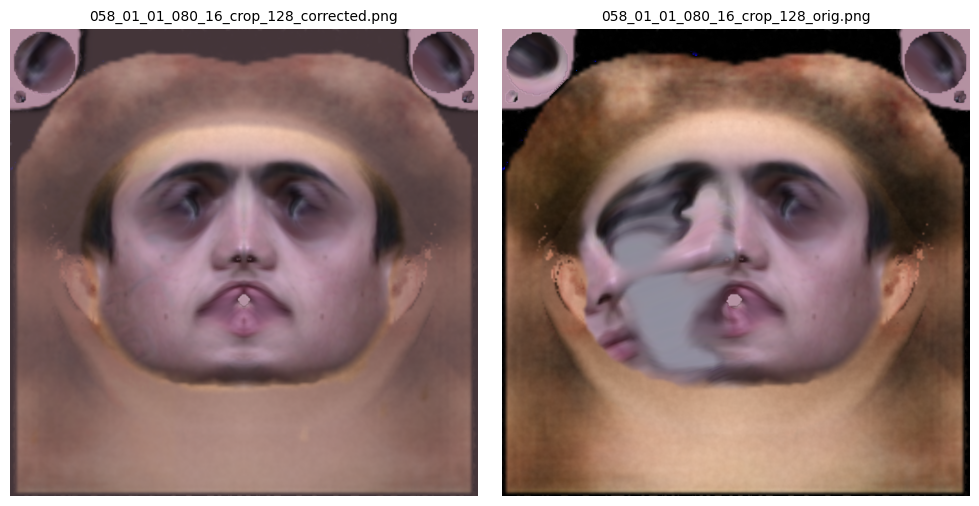
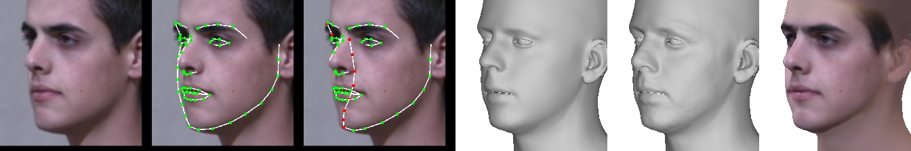
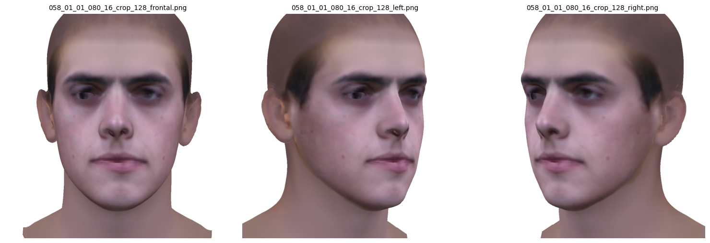

# Towards Realistic Generative 3D Face Models — UV Texture Completion via Symmetry-Guided GAN
This repository presents a **research-oriented fork** of the official implementation of:

[**Towards Realistic Generative 3D Face Models (WACV 2024)**](https://github.com/aashishrai3799/Towards-Realistic-Generative-3D-Face-Models/?tab=readme-ov-file)
, Aashish Rai et al., Carnegie Mellon University & Meta Reality Labs.

The primary goal of this fork is to investigate a self-supervised UV texture completion framework for generative 3D face modeling under extreme pose variations, self-occlusion, and large missing-texture regions.

## Overview

Reconstructing complete and realistic facial UV textures from a **single in-the-wild image** remains a challenging problem due to extreme pose variations, self-occlusion, and the absence of ground-truth UV supervision.

While the original work introduces a StyleGAN2-based framework for high-quality joint synthesis of facial geometry and texture, it assumes access to well-structured training data and does not explicitly address **UV degradation under large pose changes**.

This repository introduces **UV Symmetry GAN**, an **end-to-end self-supervised framework** for **UV texture correction and completion** from a single image, **without requiring complete UV maps, multi-view data, or 3D scans**.

## Key Idea

The core idea is to exploit the **intrinsic bilateral symmetry of human faces** as a source of **implicit supervision**.

Instead of hallucinating missing regions blindly, the method:
- identifies a *healthy* facial half using reconstructed 3D geometry,
- transfers reliable texture information from the healthy side to the degraded side,
- and refines the UV map through adversarial and perceptual supervision.

## Quick Start (Google Colab)

The easiest way to try the UV Symmetry GAN pipeline is through the provided Google Colab notebook, which runs the full UV completion and 3D reconstruction process end-to-end.

[](https://colab.research.google.com/github/ZahraEk/Towards-Realistic-Generative-3D-Face-Models/blob/main/Towards_Realistic_Generative_3D_Face_Models_.ipynb)

The notebook walks through:

- installing dependencies,
- downloading pretrained models,
- running DECA-based reconstruction,
- performing symmetry-guided UV completion,
- rendering completed 3D meshes,
- generating multi-view visualizations and rotation videos.

No local setup is required beyond a Google account.

## Inference

Conda environment: Refer environment.yml
 
   ```
conda env create -f environment.yml
conda activate new_torchenv
   ```
    
### **Pre-trained Models**

Download pre-trained models and put in the respective folders. 

Follow [[MICA](https://github.com/Zielon/MICA)] to download insightface and MICA pre-trained models. Put the weights in 'insightface' and 'data/mica_pretrained' folders, respectively.
Follow [[DECA](https://github.com/yfeng95/DECA)] to download DECA pre-trained weights. Put them in the 'data' folder.

Download AlbedoGAN modified weights from the following [[LINK](https://drive.google.com/drive/folders/1nJw8rUBTLcyhvCMTDohE_KcKKtFI6Orm?usp=sharing)]. Put these modified ArcFace backbone and DECA weights to generate better reconstruction results.

- ### **UV Texture Completion and Correction**
  
  This script extracts UV textures using DECA, estimates head pose, automatically selects the healthy facial side, and completes the occluded regions using symmetry-based UV mirroring.
  
   ```
    python img_2_tex.py
   ```
   

- ### **Reconstruct 3D Faces from 2D Images**
  
  This script reconstructs 3D facial geometry  and the completed UV texture maps.
  
   ```
    python demos/demo_reconstruct.py
   ```
   

- ### **Generate multi-pose videos**
  
  This script takes reconstructed OBJ meshes and generates smooth yaw-rotation videos by estimating the frontal orientation using facial symmetry.
  
   ```
    python video.py
   ```
- ### **Generate multi-pose images and Rotation GIF**
  
  This script generate frontal/side renders and rotation animations from reconstructed meshes.
   
   ```
  python face_view_renderer.py --mesh $input_mesh --out_dir $output_folder
   ```
  
   
Optional arguments:

`--n_frames` : number of frames in the rotation sequence (default: 30)

`--fps` : output video frame rate (default: 15)

`--side_view` : yaw offset for left/right profile rendering (default: 30.0)

`--delta_yaw` : total yaw rotation range (default: 45.0)
 
## Training code  

## Acknowledgements

This repository is based on the official implementation released by Carnegie Mellon University and Meta Reality Labs for the WACV 2024 paper "Towards Realistic Generative 3D Face Models".

We retain acknowledgements to third-party projects used in the original codebase. Parts of this repository rely on or are inspired by the following works:

1. [[DECA](https://github.com/yfeng95/DECA)]
2. [[MICA](https://github.com/Zielon/MICA)]
3. [[FLAME](https://github.com/soubhiksanyal/FLAME_PyTorch)]

Please refer to the respective license terms of these projects, as well as the X11 license of this repository, before using the code or any pre-trained models.

Additional research extensions and modifications were implemented by Zahra Ek.

## License Terms

The original project is released under the X11 License.

This fork preserves the same license. Please read the license terms available at [[Link](https://github.com/ZahraEk/Towards-Realistic-Generative-3D-Face-Models/blob/main/LICENSE)].

All original code and credit belong to the authors of the WACV 2024 paper.
Modifications and additions are provided by Zahra Ek under the same terms.

## Citation

If you find this code useful, please cite the original paper:

```bibtex
@article{rai2023towards,
  		title={Towards Realistic Generative 3D Face Models},
  		author={Rai, Aashish and Gupta, Hiresh and Pandey, Ayush and Carrasco, Francisco Vicente and Takagi, Shingo Jason and Aubel, Amaury and Kim, Daeil and Prakash, Aayush and De la Torre, Fernando},
  		journal={arXiv preprint arXiv:2304.12483},
  		year={2023}
 		}
```
